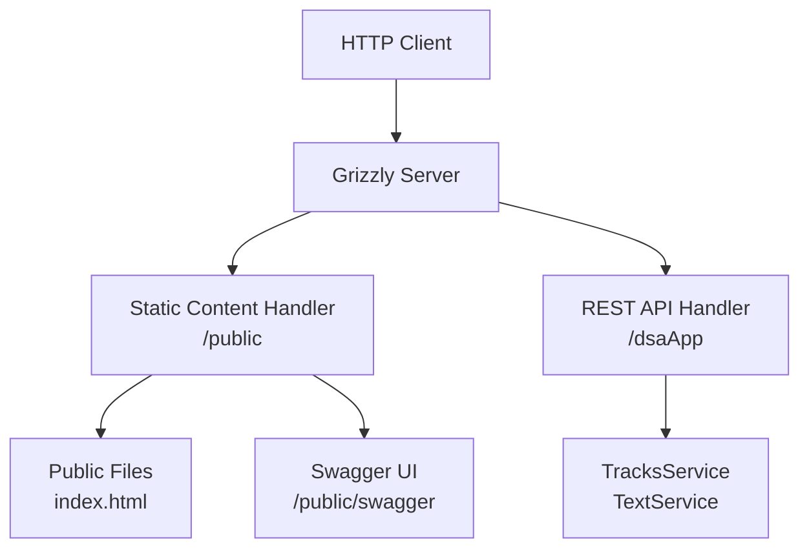
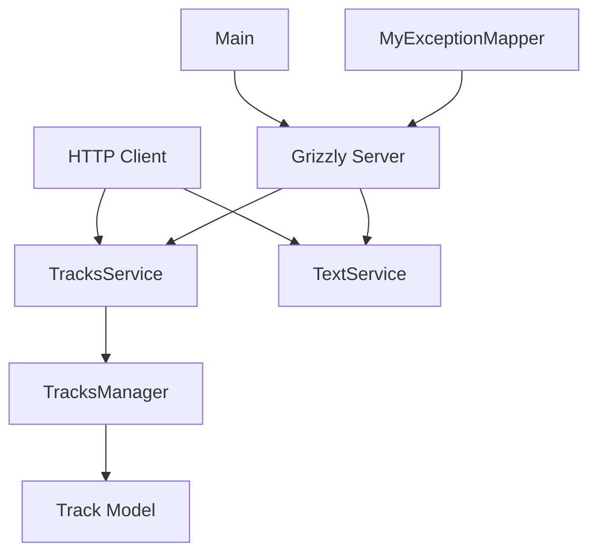

# rest-example

This project is a REST API example for managing music tracks. It is built with Java using Jersey for REST services, Grizzly as the HTTP server, and Swagger for API documentation.

## High-Level Server Structure

## Main Architecture

### Main Components:
- **TracksService**: REST service that exposes endpoints to manage tracks (GET, POST, etc.).
- **TextService**: Simple REST service for text responses.
- **TracksManager**: Interface and implementation for the business logic of track management.
- **Track**: Data model representing a music track.
- **MyExceptionMapper**: Exception mapper to handle API errors.
- **TrackNotFoundException**: Custom exception for tracks not found.
